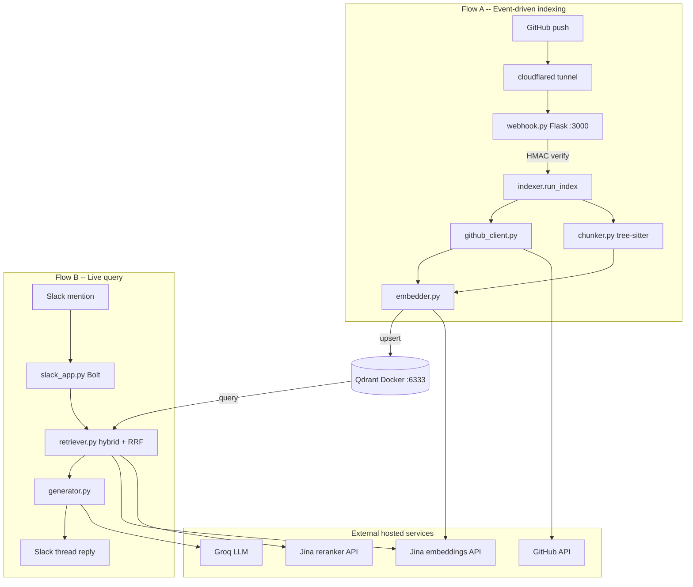

# code-rag-engine

A code-aware RAG backend that answers natural-language questions about a GitHub repository from Slack, with event-driven re-indexing on every push. A user mentions the Slack bot and asks a question; the system retrieves the most relevant code chunks from a pre-built vector index, reranks them with a hosted reranker, and responds with a plain-language answer that cites exact files and line ranges. When a push is made to the indexed repository, a GitHub webhook triggers a full re-index automatically, so answers always reflect the current codebase.

## Architecture

Two independent flows share the same vector index in Qdrant.

**Indexing flow (event-driven)**

A push to the indexed GitHub repository causes GitHub to call the webhook endpoint. The Flask server verifies the HMAC-SHA256 signature, then calls `indexer.run_index()`, which fetches all Python files from GitHub via the API, chunks them with tree-sitter along function and class boundaries, embeds the chunks via the Jina embeddings API, and upserts them into Qdrant. The previous collection is wiped and rebuilt on every run (full re-index, v1).

**Query flow (live)**

A Slack `@mention` triggers the Bolt Socket Mode handler. The bot adds an eyes reaction to signal it is working, strips the mention text to extract the question, runs hybrid retrieval (dense Qdrant search fused with TF-IDF BM25 via RRF, then reranked by the Jina reranker API), and passes the top chunks to the Groq LLM, which produces an answer citing the chunk file and line labels. The answer is posted back to the same Slack thread.



```
Indexing flow
  git push
    |
  GitHub --> cloudflared tunnel --> Flask /webhook (src/webhook.py)
                                         |
                                  HMAC-SHA256 verify
                                         |
                                  indexer.run_index()
                                    |          |
                             github_client   chunker
                             (GitHub API)  (tree-sitter)
                                    |          |
                                  embedder (Jina API)
                                         |
                                      Qdrant (Docker)

Query flow
  Slack @mention
    |
  slack_app (Bolt Socket Mode) -- src/slack_app.py
    |
  retriever -- src/retriever.py
    embed query (Jina API)
    dense search (Qdrant query_points)
    BM25 sparse (TF-IDF, sklearn, in-memory)
    RRF fusion
    rerank (Jina API)
    |
  generator (Groq, openai/gpt-oss-120b) -- src/generator.py
    |
  reply in Slack thread with citations
```

## Stack

| Component | Implementation |
|---|---|
| Embeddings | Jina AI API, model `jina-code-embeddings-0.5b`, 896 dims, task types `nl2code.passage` / `nl2code.query` |
| Reranker | Jina AI API, model `jina-reranker-v2-base-multilingual` |
| Vector DB | Qdrant `v1.18.2` in Docker, persistent named volume, `qdrant-client==1.18.0` |
| Chunking | `tree-sitter==0.25.2` + `tree-sitter-python==0.25.0`, splits on function, class, and decorated definitions |
| LLM | Groq, model `openai/gpt-oss-120b` (configurable via `GROQ_MODEL`) |
| Slack | `slack-bolt==1.28.0`, Socket Mode, `app_mention` event handler |
| Webhook | `flask==3.1.3`, `POST /webhook`, HMAC-SHA256 signature verification |
| Tunnel | cloudflared quick tunnel (temporary `trycloudflare.com` URL) |
| Sparse retrieval | `scikit-learn==1.9.0` `TfidfVectorizer`, fused with dense results via RRF |

Embeddings and reranking are hosted because the dev machine has limited RAM and cannot run local ML models alongside Qdrant.

## How it works

**Indexing pipeline** (`src/indexer.py:run_index`)

1. `github_client.fetch_python_files` — calls the GitHub REST API with a fine-grained PAT, reads the repo's default branch dynamically, returns all `.py` files as `RepoFile(path, content)` objects.
2. `chunker.chunk_files` — parses each file with tree-sitter, emits one `Chunk` per top-level function, class, or decorated definition; merges remaining top-level nodes into a single module-level chunk per file.
3. `embedder.embed_chunks` — sends chunks in batches of 64 to the Jina embeddings API with task `nl2code.passage`. The embedding dimension (896) is probed once at module load.
4. `store.setup_collection` + `store.upsert_chunks` — drops and recreates the Qdrant collection, then upserts all chunks with their payload (file path, start line, end line, text).

**Query pipeline** (`src/retriever.py:retrieve` -> `src/generator.py:generate`)

1. Embed the question with task `nl2code.query` via the Jina API.
2. Dense search: `QdrantClient.query_points` returns the top 20 candidates.
3. Sparse search: fit a `TfidfVectorizer` over all scrolled points, score all documents against the query, take the top 20 by BM25-like score.
4. RRF fusion: merge the two ranked lists with `score += 1 / (60 + rank + 1)`.
5. Rerank: send the fused candidate texts to the Jina reranker API, get back `top_n` items ordered by relevance score.
6. Build a prompt from the reranked chunks, each labelled with file and line range. The system prompt instructs the LLM to answer only from the supplied code and to cite the exact labels. If chunks are empty, `generate` returns a not-found string without calling Groq.

## Setup

### Prerequisites

- Python 3.11+
- Docker (for Qdrant)
- cloudflared (for the GitHub webhook tunnel; install from [developers.cloudflare.com/cloudflare-one/connections/connect-networks/downloads](https://developers.cloudflare.com/cloudflare-one/connections/connect-networks/downloads))
- A Slack app with `app_mentions:read`, `chat:write`, `reactions:write` bot scopes and Socket Mode enabled
- A GitHub fine-grained PAT with read access to the target repository
- A Groq API key
- A Jina AI API key

### Environment variables

Copy `.env.example` to `.env` and fill in every value. Never commit `.env`.

Required (no default):

```
SLACK_BOT_TOKEN      xoxb- bot token
SLACK_APP_TOKEN      xapp- app-level token (Socket Mode)
GROQ_API_KEY
GITHUB_TOKEN         fine-grained PAT, read contents on the target repo
GITHUB_REPO          owner/repo-name
GITHUB_WEBHOOK_SECRET  random string shared with GitHub
JINA_API_KEY
```

Optional (defaults shown):

```
GROQ_MODEL           openai/gpt-oss-120b
QDRANT_HOST          localhost
QDRANT_PORT          6333
JINA_EMBEDDING_MODEL jina-code-embeddings-0.5b
JINA_RERANK_MODEL    jina-reranker-v2-base-multilingual
COLLECTION_NAME      code_chunks
WEBHOOK_PORT         3000
```

### Install

```
python3 -m venv venv
source venv/bin/activate
pip install -r requirements.txt
```

## Running

Start each component in a separate terminal. All require the `.env` to be present and all required variables to be set.

**1. Qdrant**
```
docker compose up -d
```

**2. Initial index** (run once, and again after any manual change)
```
python3 scripts/run_index.py
```

**3. Slack bot**
```
python3 -m src.slack_app
```

**4. Webhook server** (port 3000 by default)
```
python3 -m src.webhook
```

**5. Cloudflared tunnel**
```
cloudflared tunnel --url http://localhost:3000
```

Copy the `trycloudflare.com` URL printed by cloudflared, append `/webhook`, and set it as the Payload URL in the GitHub repository's webhook settings (Settings > Webhooks). Use content type `application/json` and the same secret as `GITHUB_WEBHOOK_SECRET`.

**Tunnel URL is temporary.** The `trycloudflare.com` URL changes every time cloudflared restarts. Update the GitHub webhook Payload URL each session. To avoid this, deploy `src/webhook.py` to a permanent host (Railway or Render); see Known limitations.

After setup, mention the bot in a Slack channel it has been invited to:

```
@your-bot-name how is an expense categorized?
```

## Evaluation

The eval harness measures retrieval quality on the sample repository.

```
python3 eval/run_eval.py
```

Pass an integer to change k: `python3 eval/run_eval.py 3`

**Measured results** (11 questions, k=5, against `Zakeertech3/code-rag-sample-app`):

| Metric | Value |
|---|---|
| Hit rate at k=5 | 1.000 (11/11) |
| Mean recall | 0.955 |
| MRR | 0.955 |

**Known retrieval limitation:** the multi-file question "how are expenses categorized in bulk and then added to the store" retrieved `main.py` (the calling file) at rank 1 but missed `categorizer.py` (the defining file) in the top 5, yielding recall 0.50 for that question. This is a cross-file reasoning gap: the retriever ranks the usage site above the definition. A code call graph (v2 direction) would resolve it.

## Known limitations and v2

**v1 limitations:**

- Full re-index on every push. The collection is wiped and rebuilt each time. For small repos this takes a few seconds. For larger repos, incremental indexing (hash files, re-embed only changed files, remove deleted chunks) is needed.
- No cross-file reasoning. The retriever operates on individual chunks; it does not follow import or call relationships across files. A question whose answer requires understanding that file A calls file B may surface A without B.
- Temporary tunnel URL. The cloudflared quick tunnel URL changes on restart, requiring the GitHub webhook Payload URL to be updated each session.
- Python only. The chunker uses the tree-sitter Python grammar. Other languages require additional grammar packages and chunker support.

**v2 directions:**

- Incremental indexing: hash each file, re-embed only changed files, delete chunks for removed files.
- Code graph: build a call and import graph alongside the vector index; use it to expand retrieval across file boundaries.
- MCP server: expose the retriever as an MCP tool so the engine is reusable beyond Slack.
- Permanent deployment: deploy `src/webhook.py` to Railway or Render for an always-on webhook URL with no tunnel required.
